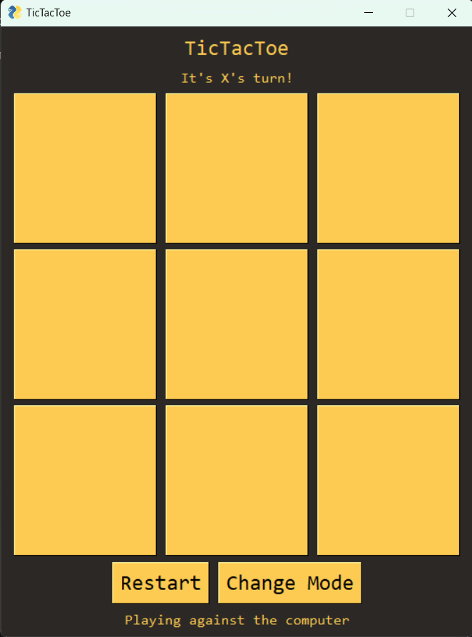
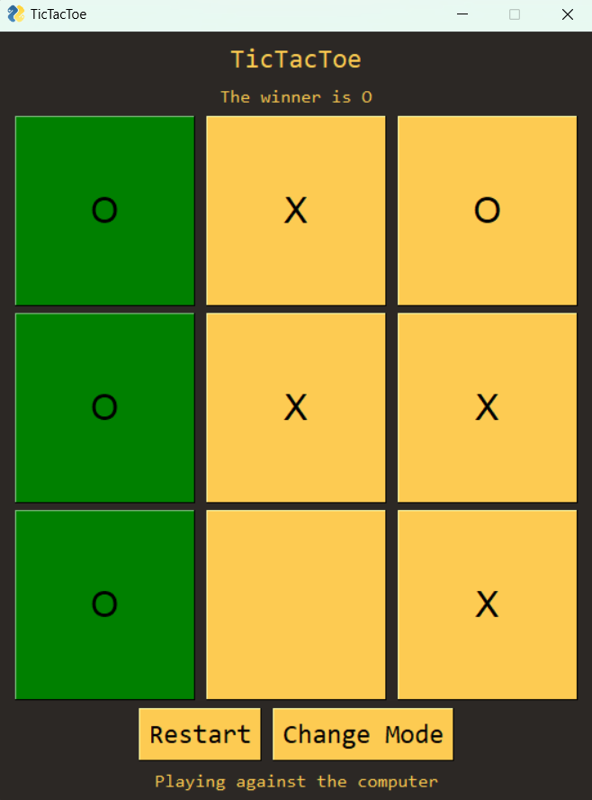

# TicTacToe

A simple program written in an afternoon that allows you to play against the computer or a friend of yours.

It uses the well known minimax algorithm with the help of alpha-beta pruning.

#### Dependencies:

* The program uses PySimpleGUI in order to display the UI
* You need to have tkinter installed as well

Tested on Windows and Linux

#### TODO:

* Would love to add networking functionality some day so you can play against a friend on the other side of the globe

## Instructions on running the application

1. Download the source code/clone the repository
2. Navigate to the project's directory
3. Create a virtual environment using `py -m venv .venv` and activate it (Optional)
4. Install the dependencies using `pip install -r requirements.txt`
5. Run the application using `py main.py`

## Examples

